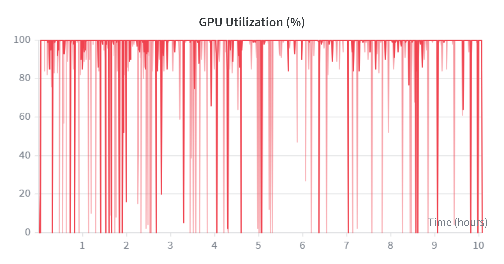
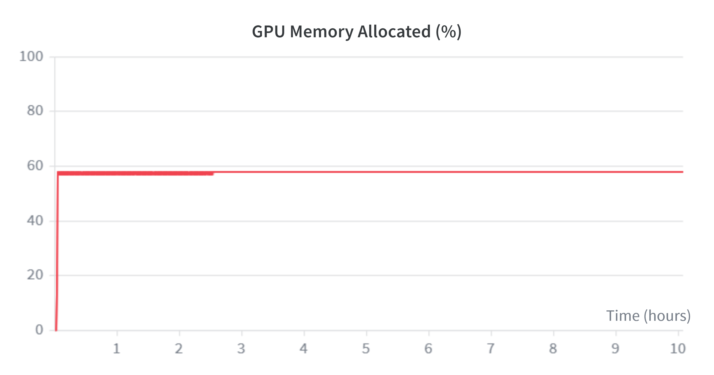
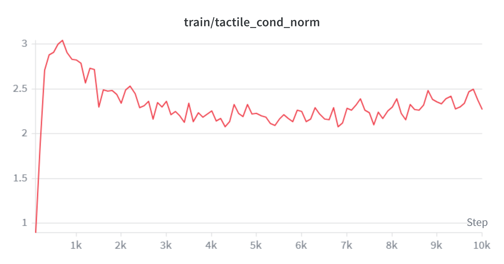
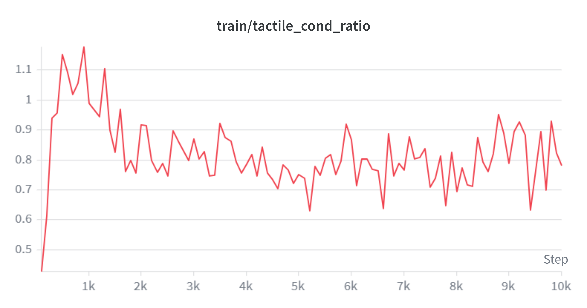
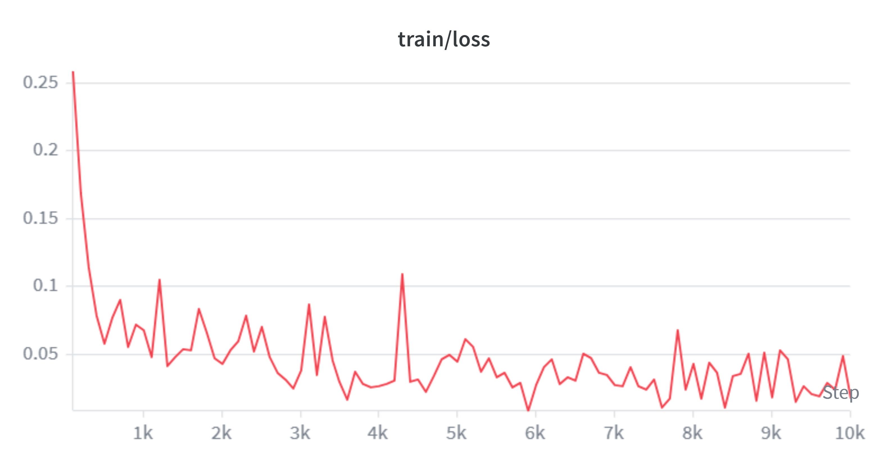
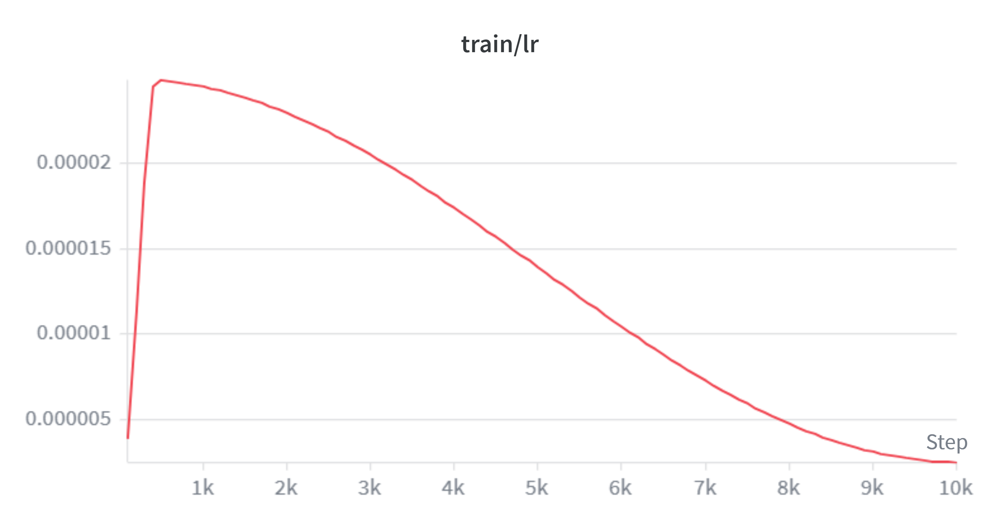

# Technical Report — open-drawer

**Track 3: Physical AI Challenge**

A Franka Panda opens the drawer a language prompt asks for — one of two that are
geometrically and visually identical. It pulls until the drawer meets a travel
stop, a limit randomized every episode that nothing in the scene reveals, feels
that stop through a fingertip tactile array, and releases.

The environment is built in Genesis. The policy is pi0.5, a vision-language-action
model, fine-tuned with a tactile conditioning pathway added to its action expert.

## Deliverables

- **Source repository** — parametric Genesis environment, scripted teacher,
  dataset collection, policy extension, training and closed-loop evaluation.
- **Reproducibility README** — setup, dependencies, and the command sequence
  that reproduces the reported numbers.
- **Demonstration video** — produced by `uv run render` for the teacher and by
  `uv run evaluate --video` for the policy, both with live task state (travel
  against the episode's stop, tactile reading, cabinet displacement) burned into
  the frame.
- **Dataset** — 1024 LeRobot-format demonstrations, 170,624 frames.
- **Fine-tuned checkpoint** at 10000 steps, and the closed-loop evaluation in §6.
- **This report.**

---

## 1. Target application

**Articulated-object manipulation with an unknown mechanical limit.**

Every drawer ends somewhere, and the robot cannot know where. It sees a handle —
not where the rail ends, not where the stop sits, not how far the mechanism will
travel before it binds. Nor is the limit always where the design put it: drawers
jam on their contents, rails bend, something gets in the way. The same shape
governs doors, cabinets and panels; trays in racks; levers and valves; any
assembly step that ends when a part seats rather than after a fixed distance. In
all of them the moment to stop belongs to the mechanism, not to the plan.

A policy that treats "open the drawer" as a fixed displacement is therefore
guessing, and the two ways of guessing wrong are not equal. Stopping short costs
a retry. Pulling past the limit costs the equipment — damaged furniture, a
torn-out drawer, a dragged cabinet, a broken slide, an arm tripping its own
protective stop. Force removes the guess. It reports the limit at the instant
the limit arrives, designed stop or jam or obstruction alike, and all three call
for the same response: stop pulling. A robot acting on contact stops because the
mechanism told it to, not because a counter ran out — which is what makes it
safe to work against hardware it has never seen, in a home, a warehouse aisle or
a laboratory.

The task here is the smallest honest version of that problem. A cabinet stands
free on a table with two drawers, left and right. A prompt asks for one of them:
"open the left drawer". The drawer it names stops at a limit that can only be
felt. Nothing in that arrangement is decoration; each modality decides something
the other two cannot supply.

| Modality | Decides | Why it cannot be skipped |
|---|---|---|
| Language | *which* drawer | The drawers are identical — only the prompt says left or right |
| Vision | *where* the handle is | The cabinet's pose is randomized per episode |
| Touch | *when* to stop | The travel stop is randomized and invisible to any camera |

## 2. System architecture and solution design

```
                    Genesis (GPU, batched over N environments)
  ┌────────────────────────────────────────────────────────────────┐
  │  cabinet + Franka Panda + fingertip taxel arrays               │
  │  per-env randomization: target side, travel stops, pose        │
  └───────────────┬──────────────────────────────┬─────────────────┘
                  │                              │
      scripted teacher (privileged)       policy in the loop
                  │                              ▲
                  ▼                              │
         LeRobot dataset  ──────►  pi0.5 + tactile fine-tune
      (wrist RGB, state, tactile,        (bf16, 8-bit AdamW)
       action, language prompt)
```

**Scene.** A two-drawer cabinet stands free on a table, generated
parametrically as a single MJCF body: carcass, two drawers on slide joints, and
a bar rail on each drawer front standing 40 mm proud with a 28 mm slot behind
it. The Panda approaches tool-down, straddles the rail — one finger in front,
one in the slot — closes, and pulls. That geometry is deliberate: it puts the
pull load on the pads as a **normal** force rather than relying on friction.

**Randomization,** per environment, per episode: which drawer the prompt names;
each drawer's travel stop, sampled from 60–130 mm; cabinet position (±20 mm)
and yaw (±8°); and a deliberate 0.5–3 mm misalignment left in by the descent so
the dataset contains corrections rather than only perfect approaches.

**Teacher.** Six phases run in lockstep across all environments — approach,
descend, grip, pull, release, retract — with per-environment branching handled
by masked commands rather than ragged control flow. The teacher is allowed
privileged simulator state, but deliberately does **not** use it for the
release: it triggers on the *measured* taxel reading, because a teacher that
released on privileged knowledge would pair identical observations with
different correct actions and make the behaviour unlearnable.

**Scoring.** An episode succeeds only if the target drawer reached its stop, the
gripper released, the other drawer never moved, and the cabinet stayed put —
all held for 8 consecutive control steps. Failure modes are counted separately
(wrong drawer, released short, never released, cabinet dragged), and *release
latency* — control steps between the true stop and the release — is reported as
the measure of how well the tactile channel is doing its job.

## 3. Datasets

**Self-generated.** No external dataset is used. Demonstrations are produced by
the scripted teacher in simulation and written in LeRobot format.

| Field | Shape | Notes |
|---|---|---|
| `observation.images.wrist` | 224×224×3 | single wrist camera, mp4-encoded |
| `observation.state` | 9 | 7 arm joints + 2 finger positions |
| `observation.tactile` | 24 | 2 fingers × 4 taxels × 3 force components |
| `action` | 9 | per-joint command deltas |
| `task` | text | `"open the left drawer"` / `"open the right drawer"` |

Recorded at **25 Hz** (every 4 control steps of a 100 Hz simulation). Only
successful episodes are written.

As collected: **1024 episodes, 170,624 frames**, 166 frames per episode on
average (6.6 s), recorded in 8 batches of 128 environments. No episode was
dropped — the teacher succeeded in all 1024. Generation took **81.7 minutes**
end to end, 12.5 episodes/min; §4 breaks that time down.

On disk it is **256 MB**, about 1.5 KB per frame. The same frames held raw, as
they are in RAM during collection, would be 25 GB — the ~100× is mp4 encoding
of the wrist stream, and it is the reason collection is bounded by encoding
time rather than by storage. Roughly 29 MB of the total is the parquet holding
state, action and tactile.

Two properties of this dataset are contracts rather than conventions, and both
are documented at the point of use:

- **An action is a command, not an achieved motion** — `q_cmd - q_measured`.
  This preserves the standing offset a position-controlled arm needs simply to
  hold itself against gravity. Recording achieved motion would label every hold
  "do nothing", and a policy obeying that at inference would sag further every
  step.
- **Tactile is a separate feature, never merged into `observation.state`** —
  see §5.

## 4. Use of AMD Radeon GPU and ROCm

Every stage of the pipeline runs on a single Radeon GPU through ROCm.

**Simulation.** Genesis executes the rigid-body solver, collision detection and
constraint solving on the GPU, batched across N environments in lockstep. The
batching is the point: all randomization is per-environment state, and every
primitive — IK, control, sensing, scoring — is written as a batched array
operation so that N=1 and N=256 take the identical code path. A Python loop
anywhere in the reset or control path would cap throughput regardless of GPU
capability, so there is none.

**Rendering.** Wrist-camera observations are rendered on-GPU per environment
(`env_separate_rigid`), producing one image per environment per control tick
during collection.

**Tactile sensing.** The taxel arrays are evaluated by Genesis's own compiled
GPU kernels, batched over environments alongside the physics — the sensing is
not a CPU-side post-process.

**Training.** pi0.5 (≈4B parameters) is fine-tuned on a single GPU. Three
choices make that fit: bfloat16 weights, gradient checkpointing, and a
bitsandbytes 8-bit AdamW that halves optimizer moment state. The 8-bit
optimizer required a serialization shim, since bitsandbytes' state violates
safetensors' constraints in two ways (a Python-int `step`, and quantization
maps shared by reference across parameters).

**Inference.** Closed-loop evaluation runs policy inference and physics on the
same GPU, with the policy serving action chunks from an internal queue so a
forward pass runs once per chunk rather than once per control step. Timed at the
chunk boundaries, around the whole call — the forward is asynchronous, so a
narrower measurement would time kernel launches rather than work:

| environments | per forward pass | per environment | budget |
|---|---|---|---|
| 1 | median 349 ms, max 361 | 349 ms | 160 ms |
| 16 | median 2190 ms, max 2215 | 137 ms | 160 ms |

The budget is what a chunk buys: `n_action_steps` = 4 actions at the 25 Hz
control rate, so 160 ms before the next forward pass is due.

Two things follow. **Batching is 2.5× more efficient per environment** — 137 ms
against 349 — so at N=1 the model is bound by launch overhead and memory traffic
rather than by arithmetic, and the card is underused. Aggregate throughput is
already inside the budget.

**A single robot is not, at 349 ms against 160.** That gap closes without
retraining. `n_action_steps` is an inference-time parameter, and `chunk_size` is
16 — the policy predicts 16 actions and currently executes 4 of them before
asking again. Executing 10 raises the budget to 400 ms and clears the measured
349 with margin, at the cost of a longer open-loop window between observations.
Whether that trade is acceptable is a control question rather than a compute
one, and the checkpoint supports either answer as it stands.

Measured throughput of the scripted teacher with no cameras in the scene, so the
figures are physics alone. Two batches at each N:

| N (envs) | batches | episodes | wall | episodes/min | speedup | success |
|---|---|---|---|---|---|---|
| 32 | 2 | 64 | 31.6 s | 121.5 | 1.0× | 64/64 |
| 64 | 2 | 128 | 31.3 s | 245.6 | 2.0× | 128/128 |
| 128 | 2 | 256 | 33.3 s | 461.3 | 3.8× | 256/256 |
| 256 | 2 | 512 | 34.8 s | 882.7 | 7.3× | 512/512 |

Eight times the environments for 10% more wall time. The wall clock is the fixed
step count of one lockstep episode almost independently of N, which is the
result the batched-array design was aiming for; the residual 10% is the only
part of the pipeline that grows with the batch.

Collection is a different curve, and is measured separately for that reason.
Repeating the sweep with the wrist camera on and a recorder attached — the
configuration collection actually uses — separates the two costs. One batch at
each N here rather than two, so the physics column is the table above halved:

| N (envs) | physics only | + rendering | render cost | buffered | device |
|---|---|---|---|---|---|
| 32 | 15.8 s | 22.0 s | +6.2 s | 0.8 G | 1.3 G |
| 64 | 15.7 s | 27.8 s | +12.2 s | 1.6 G | 1.5 G |
| 128 | 16.7 s | 38.3 s | +21.7 s | 3.3 G | 1.5 G |

**buffered** is host RAM held by the recorder — a whole batch of frames, kept
until the episode is written. **device** is whole-device GPU memory rather than
torch's own accounting, because Genesis allocates its physics and renderer
outside the torch allocator, which is most of what is resident here.

Physics is flat in N; rendering doubles with it. Past N≈64 rendering is the
majority of the cost, so the physics curve above predicts nothing about
collection throughput. Device memory is flat at 1.5 G and never binds — the
constraint is host RAM, which grows at 26 MB per environment because a whole
batch of frames is held until the episode is written.

**What actually dominates dataset generation is neither.** The full run —
1024 episodes in 8 batches of 128 — took 81.7 minutes. Simulation and rendering
account for about 5 of those (38.3 s per batch, measured above). The remaining
**94% is the LeRobot writer**, encoding 170,624 frames of wrist video at roughly
27 ms per frame on CPU.

This is kept alongside the scaling tables rather than replaced by them, because the
tables are accurate about what they measure and misleading about what matters.
Both curves, and the host-RAM ceiling that bounds the second, turn out to
govern 6% of the wall clock: the choice between N=128 and N=256 changes total
collection time by a few percent, not by the 30% the throughput figures imply.
Dataset generation here is a single-threaded video-encoding problem wearing a
GPU-throughput costume, and the only optimization that would move it is
parallel or hardware-accelerated encoding in the writer.

**Training, measured.** Ten steps per configuration, everything else at the
defaults above:

| optimizer | batch | peak memory | step | samples/s |
|---|---|---|---|---|
| 8-bit AdamW | 16 | 26.2 GiB | 3.55 s | 4.5 |
| 8-bit AdamW | 32 | 31.0 GiB | 6.90 s | 4.6 |
| stock AdamW | 16 | 37.2 GiB | 3.47 s | 4.6 |

Quantizing the moments saves **11 GiB at matched batch size** for a 2% step-time
cost. The arithmetic predicts 7.7 GiB for halving 4.14B parameters' moment
state; the remainder is allocator overhead.

Throughput is flat in batch size — doubling the batch doubles the step time
exactly, so training is compute-bound and a larger batch buys gradient quality
rather than speed. Batch size is therefore a wall-clock decision rather than a
throughput one, and training runs at **batch 16 with the 8-bit optimizer** for 10000
steps: ~160k samples, a little under one pass over the dataset, in ~10 hours.
Memory scales at 0.3 GiB per sample, so neither size approaches the card's
ceiling; the reason not to take batch 32 is that the same number of updates
would cost twice the wall clock.

Weights & Biases recorded the card itself across the ten-hour run:





Utilization sits pinned at 100% with brief dips for checkpoint writes and
dataloader stalls, which is what compute-bound looks like and corroborates the
flat throughput above — there is no idle time a larger batch could absorb.
Allocated memory is flat at 57% for the entire run: the batch-16 footprint with
the 8-bit optimizer, and visibly the headroom that §6 revisits.

## 5. Innovations and key technical contributions

**(a) A tactile pathway into pi0.5's action expert.**
pi0.5 does not feed `observation.state` to the action expert as a vector: it
normalizes it, digitizes it into 256 bins, and pastes it into the *text prompt*
alongside the task string. Appending a force signal there would send it through
the tokenizer 8-bit quantized — and this signal is quiet for most of an episode
and then steps, so per-dimension normalization would collapse the quiet
majority into one or two bins while the contact event saturates. Precisely the
wrong channel for the one transient the task turns on.

Instead, a small MLP encodes the 24-dim taxel field and its output is **added to
`adarms_cond`**, the single vector that modulates every adaRMSNorm layer in the
action expert. In stock pi0.5 that vector is a function of the flow-matching
timestep and nothing else: it tells the expert where it is in the denoising
process. Adding the tactile encoding to it puts touch on the same continuous
path, straight into the action decoder with no tokenizer in between — so the
expert is modulated by when it is in the denoising process *and* by what the
fingers feel. The encoder's output layer is **zero-initialised**, so at step 0
the sum is exactly the timestep vector, the model is bit-identical to pretrained
pi0.5, and the tactile pathway grows from zero rather than perturbing a working
4B model.

The same zero initialization that makes the pathway safe also makes it
invisible: a run in which tactile carries nothing produces an identical loss
curve to one in which it carries everything. The norm of the tactile
contribution, and its ratio to the timestep conditioning it is added to, are
therefore logged every step — they are the only evidence during training that
the modality is being used at all.





Both start at exactly zero, by construction. Within roughly 500 steps the norm
reaches 3.0 and the ratio peaks just above 1.0: the model reaches for touch
immediately, and briefly weights it as heavily as the flow-matching timestep it
is added to. It then settles to a plateau near 0.75 by step 4000 — tactile
contributes about three quarters of the magnitude of the conditioning vector it
shares, which is substantial without swamping it.

Over the final third both drift back up, the ratio from roughly 0.72 to 0.85.
The signal is noisy and carries little on its own, but it is the
training-side counterpart to the improvement in release behaviour that §6
measures over the same interval.

**(b) An invisible, per-environment task parameter.**
Each drawer's travel stop is randomized *per environment* using Genesis's
batched DOF-limit facility. This makes "how far to pull" genuinely
unobservable — not merely hard to see — which is what forces the policy to
close the loop on touch rather than on memorized geometry.

**(c) Task design that makes the modality necessary.**
An earlier formulation of this task is degenerate: with a hard stop and no
penalty, a policy that pulls for the maximum duration and then opens its jaws
succeeds every time without ever using touch. This is resolved physically
rather than with a scoring rule — the cabinet is unanchored, so over-pulling
transfers load into it and drags it, and success requires it to have stayed
put. The consequence is visible in the demonstration video, not just in a
metric.

**(d) Empirical characterization of a simulated tactile sensor.**
Genesis's `KinematicTaxel` measures probe *penetration*, not contact force.
Against a rigid handle the pads deform by micrometres under load and the
reading is flat — measured at 0.19 N through an entire pull, unchanged when the
drawer bottomed out. Two changes made it work: a compliant contact on the rail,
so the pads sink measurably under load, and a reduced grip squeeze, so that
load dominates the reading instead of a large constant preload. The bands
became 0.16–0.23 while sliding and 0.28–0.46 against the stop, stepping at each
environment's own stop. **The release threshold is measured from those bands,
not chosen.** It is recorded as a finding because the naive configuration
produces a sensor that appears to work and silently carries no information.

**(e) A dataset-contract regression.**
The teacher acts at the rate the policy will. `record_every` sets when a command
is *issued*, not merely when one is stored, so the arm holds each target for a
full 40 ms tick exactly as it will under a policy; the teacher still recomputes
IK and closes its loops every simulation step, and only the command rate drops.
Without that, a recorded action would be one point off a 100 Hz ramp that at
inference is held for 40 ms — the arm reaching targets the ramp only passed
through, and the dataset describing a controller that never runs.

The regression checks that this holds. Feeding the teacher's own recorded
actions back through the inference loop must reproduce the demonstration
exactly, and it runs without a checkpoint — so a disagreement between the
recorded actions and the deployment loop surfaces before a training run rather
than after one. This dataset reproduces at 16/16 with 0.00 mm divergence.

## 6. Results to date

Teacher, 128 episodes at N=64:

| | |
|---|---|
| success | 128/128 |
| opened / released | 128/128 / 128/128 |
| wrong drawer / cabinet dragged | 0 / 0 |
| travel | mean 95.9 mm |
| shortfall | mean 0.00 mm, max 0.00 mm |
| cabinet displacement | mean 0.25 mm, max 0.68 mm (limit 10 mm) |
| release latency | mean 131, median 132, max 205 control steps |

**Shortfall** is how far short of its own stop the drawer was left: the
episode's travel stop minus how far the drawer actually opened. Zero means the
drawer reached the stop; a shortfall equal to the stop means it never moved.

A further 960 episodes across the throughput sweep succeeded without exception.

Release latency is the figure that distinguishes tactile stop detection from a
task that merely completes: it is bounded well inside the 400-step pull budget,
so the release is triggered by the measured contact and not by the pull phase
running out. An episode that never felt its stop would still score as a success
on every other row of this table.

Replay regression: teacher 16/16, replay 16/16, max travel divergence 0.00 mm.

### Trained policy

64 episodes, 4 batches of 16 environments, same seed for both checkpoints, so
the two columns score the same 64 episodes.

| | 7500 steps | 10000 steps | teacher |
|---|---|---|---|
| success | 11/64 (17.2%) | 22/64 (34.4%) | 128/128 |
| opened | 25/64 | 37/64 | 128/128 |
| released | 12/64 | 22/64 | 128/128 |
| shortfall | mean 50.73 mm | mean 35.78 mm | mean 0.00 mm |
| wrong drawer | 0 | 0 | 0 |
| cabinet dragged | 1 | 0 | 0 |
| cabinet displacement | mean 3.40, max 96.07 mm | mean 1.14, max 6.37 mm | mean 0.25, max 0.68 mm |
| release latency | mean 142, median 102 | mean 95, median 72 | mean 131, median 132 |

Each column is a single evaluation run. The episodes are seeded, but the
policy's flow-matching sampler is not, so these scores carry run-to-run variance
that 64 episodes does not average away.

**At 10000 steps the 64 episodes split three ways.** 27 never get the drawer
open. 15 pull it to its stop but never let go. 22 complete the task. Put another
way: 58% get the drawer to its stop, and 59% of those release correctly.

The 27 barely move the drawer. Shortfall averages 35.8 mm over all 64 episodes,
and an episode counted as `opened` is within a tolerance of its stop by
definition — so essentially all of that total belongs to the 27, roughly 85 mm
apiece against stops averaging 95 mm. That leaves them averaging about 10 mm of
travel: a nudge rather than a pull. Whether that is 27 small nudges or a handful
of partial pulls among mostly untouched drawers, the aggregate cannot say; the
evaluation reports one shortfall mean and no distribution.

Their failure is manipulation precision, which sits *underneath* the three
modalities the task was built to test rather than inside any of them. The 15
that reach the stop and never let go are the tactile channel itself.

**Language selection is exact.** Zero wrong-drawer errors across 64 policy
episodes and 128 teacher episodes, against two drawers that are geometrically
and visually identical. Nothing but the prompt distinguishes them.

**Release timing beats the teacher it imitates.** Median latency of 72 control
steps against the teacher's 132, and mean 95 against 131 — while the teacher
releases on a fixed threshold crossing followed by a fixed jaw-opening ramp.

**The over-pull consequence fired once, and that is the only time it has.** The
7500-step checkpoint dragged the cabinet 96 mm — an episode that reached the
stop, kept pulling, and moved the furniture. Every other run in this project,
teacher and policy, released in time. It is the single direct observation that
the penalty designed in §5 is reachable in practice and not only in arithmetic,
and it is what the ~17 N drag threshold sitting under the arm's ~25 N capability
was for.

### The run was not converged





Loss falls from 0.26 to about 0.03, most of it inside the first 300 steps, and
then descends slowly and noisily to the end without flattening. Underneath it is
pi0.5's own preset restated: 333 warmup steps — the 1000 in the config scaled by
`--steps` against `num_decay_steps`, and visible as the peak just after step 300
— then cosine decay to 2.5e-6.

10000 steps at batch 16 is roughly 160k samples — a little under a single epoch
of the dataset — and the number was set by the hackathon clock at 3.55 s/step,
not by a validation curve. **Longer training and a larger batch would both be
expected to help.** The evidence is in the table: between 7500 and 10000 steps —
the last quarter of the schedule, at a learning rate already decayed to roughly
a sixth of peak — episodes reaching the stop went from 25/64 to 37/64, and
releases from 12 to 22. A policy still gaining that much in the tail of its own
decay is one that stopped early, not one that plateaued.

Memory was never the binding constraint. The card holds batch 32 at 31 GiB and
scales at 0.3 GiB per sample, so batch 64 was available. Throughput is flat in
batch size, so under a fixed clock a wider batch buys lower gradient variance at
the price of proportionally fewer updates, and the updates were judged worth more.
That trade looks different now that the dominant failure is known to be grasp
precision: fine positioning is exactly where gradient noise is expensive, so the
wider batch passed over here may be worth more than the step count suggested at
the time. Given a longer budget this run would be several epochs at batch 64 —
both axes, not one.

The checkpoint's score is a lower bound on what the design reaches, not its
ceiling.

## 7. Upstream contributions

Two gaps in the underlying libraries surfaced while building this. Both are
suitable for patches upstream, and both are **still to be done** — they are
recorded here as intended follow-ups, not as work already submitted.

**Genesis — `RigidEntity.set_dofs_limit`.** `RigidEntity` exposes
`get_dofs_limit` and every sibling DOF setter, but no matching
`set_dofs_limit`, even though the batched implementation already exists one
level down on the solver. This project reaches past the entity to
`scene.rigid_solver.set_dofs_limit` with global DOF indices; an entity-level
wrapper taking local indices would make per-environment joint limits a
first-class operation instead of an implementation detail callers have to know
about.

**LeRobot — a registry for the policy factory.** `make_policy` resolves policy
classes through a hardcoded if/elif chain, so an externally defined policy
cannot be selected by `--policy.type` without patching the factory itself. A
registration decorator — matching the one `OptimizerConfig` already provides,
and which this project uses for its 8-bit optimizer — would let third-party
policies plug in unmodified.

## 8. Team

**Akbar Tokochev** — sole participant. Task and environment design (the
parametric cabinet, per-environment randomization, and the fingertip tactile
sensing with its calibration); the scripted teacher and the dataset generation
pipeline; the tactile conditioning pathway into pi0.5 and the training setup on
ROCm; closed-loop evaluation; and this report.
